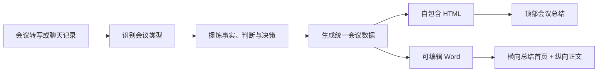
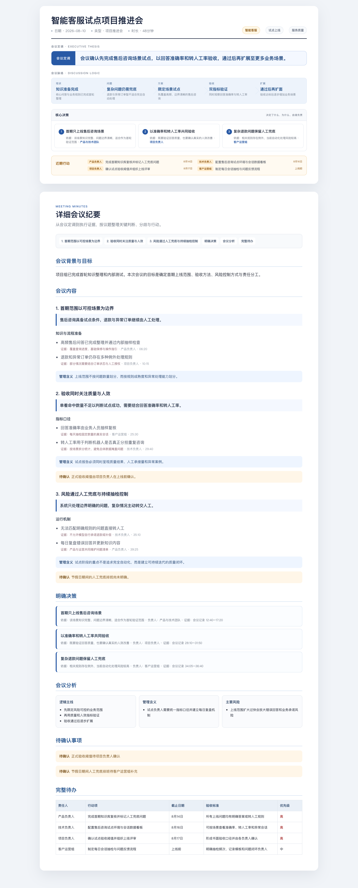
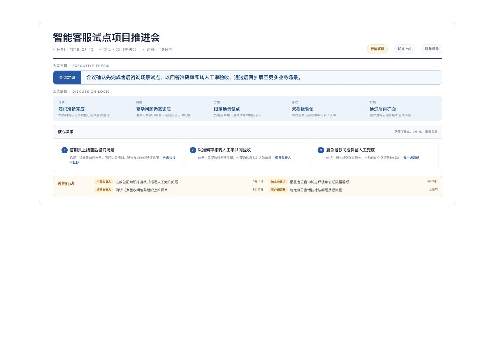

# Meeting Minutes Pro

把会议转写、录音文字稿或聊天记录，整理成一份可决策、可查证、可执行的专业会议纪要，并同时生成便于浏览分享的 HTML 和可编辑的 Word 文档。

它不是简单地压缩原文，也不是把若干字段机械排版。它会先识别会议类型，再区分事实、观点、决策、风险、待确认事项和行动项，最终形成适合管理者阅读和团队执行的正式纪要。

## 能解决什么问题

普通会议摘要经常存在这些问题：

- 只有大段概括，看不出会议最终决定了什么。
- 把建议、观点和正式决策混在一起。
- 只记录过程，没有责任人、期限和验收标准。
- 数字很多，但没有说明数字与结论的关系。
- 在线页面适合浏览，下载后的 Word 却排版混乱。
- 为了制作一页总结，需要依赖白板、PPT 或其他第三方设计工具。

Meeting Minutes Pro 将这些工作整合成一个可复用流程：



## 效果预览

以下截图使用完全虚构的演示会议生成，仅保留角色名称，不包含真实公司、项目、客户或个人信息。

### HTML 页面

HTML 将一页式会议总结与详细纪要放在同一个自包含页面中，适合浏览器查看和内部分享。



### Word 文档

Word 首页面向快速汇报，采用横向的一页总结；第二页起切换为纵向、可编辑的详细会议纪要。



## 主要能力

### 1. 聚焦会议结论

顶部总结只回答四个问题：

1. 会议讨论的主线是什么？
2. 最终定调是什么？
3. 做出了哪些决定？
4. 接下来由谁做什么？

数字不会被单独堆成数据看板，而是放在会议脉络、决策依据或行动目标中，避免喧宾夺主。

### 2. 保留决策依据

每项核心决策可以同时记录：

- 决策内容
- 形成决策的原因
- 责任人或负责团队
- 原文依据或时间戳

这样既方便快速阅读，也能回到会议原文核查。

### 3. 生成分层详细纪要

正文按照“议题结论 → 事实与证据 → 管理含义 → 待确认事项”的结构组织，并保留真实分歧、约束条件、风险和案例，不会变成只有结论的薄摘要。

### 4. 输出可执行待办

行动项使用统一结构：

> 责任人 + 具体动作 + 期限 + 验收标准 + 优先级

对于会议中没有明确的信息，会如实标记“待指定”或“未明确”，不会自行补造。

### 5. 同时生成 HTML 和 Word

- **HTML**：单文件、自包含、响应式，适合直接打开、内部发布和网页分享。
- **Word**：第一页为横向会议总结，第二页起为纵向可编辑正文，适合下载、归档和发送给其他用户。
- 两种格式来自同一份 JSON 数据，确保决策、数字和待办保持一致。

## 适用场景

- 决策会：突出决策、依据、负责人和后续动作。
- 项目推进会：突出进展、阻塞、方案和里程碑。
- 工作汇报会：突出成果、差距、结论和下一阶段计划。
- 培训或宣讲会：突出核心观点、重要共识和落地要求。
- 复盘会：突出结果、原因、经验、问题和改进动作。
- 访谈或交流会：突出主题洞察、观点分歧和待跟进事项。

## 使用案例

### 输入

用户提供一份会议转写稿，并提出：

> 请把这份项目推进会整理成专业会议纪要，生成 HTML 和 Word。重点保留最终决策、争议点、负责人和待办，不要把讨论建议写成正式决定。

### 处理结果

技能会先形成结构化会议数据，例如：

```json
{
  "title": "智能客服项目推进会",
  "executive_summary": "会议确认先完成售后场景试点，通过准确率与人效验证后再扩大覆盖范围。",
  "decision_path": [
    {
      "stage": "现状",
      "title": "试点数据已具备",
      "description": "已完成首轮场景验证"
    },
    {
      "stage": "决策",
      "title": "先验证再扩面",
      "description": "以准确率和人效作为验收条件"
    }
  ],
  "key_decisions": [
    {
      "decision": "优先上线售后咨询场景",
      "rationale": "数据质量和业务流程相对成熟",
      "owner": "客服产品团队",
      "evidence": "会议原文 18:20–21:10"
    }
  ],
  "action_items": [
    {
      "owner": "项目经理",
      "action": "完成试点上线并建立数据看板",
      "deadline": "本月底",
      "acceptance_criteria": "准确率与转人工率达到会议约定标准",
      "priority": "高"
    }
  ]
}
```

最终输出包括：

- 一页式顶部会议总结
- 按议题展开的详细纪要
- 明确决策及其证据
- 风险和待确认事项
- 完整行动项表格
- HTML 文件和 DOCX 文件

## 在 Codex 中使用

将本仓库安装为 Skill 后，可以直接对会议文字稿发出类似指令：

```text
使用 $meeting-minutes-pro 整理这份会议记录，生成 HTML 和 Word 会议纪要。
```

也可以补充更具体的要求：

```text
使用 $meeting-minutes-pro 整理这次复盘会。
重点保留失败原因、分歧、明确决策和有责任人的待办；
不能确认的信息标记为待确认，不要自行推断。
```

技能会按照 [`SKILL.md`](SKILL.md) 中的流程读取原文、构建会议数据、执行校验、生成文件并进行视觉验收。

## 手动运行生成器

如果已经准备好符合规范的 `meeting-data.json`，可以直接运行：

```bash
python3 scripts/validate_meeting_data.py meeting-data.json
python3 scripts/generate_minutes.py meeting-data.json --output-dir output
```

生成目录包含：

```text
output/
├── <会议标题>-会议纪要.html
├── <会议标题>-会议纪要.docx
└── .build/
    └── <会议标题>-会议纪要-总体总结.png
```

## 运行依赖

| 依赖 | 用途 |
|---|---|
| Python 3 | 数据校验、HTML 和 Word 内容生成 |
| agent-browser | 离线渲染 HTML、截取顶部总结、响应式验收 |
| officecli | 创建可编辑 DOCX |
| documents Skill | 将 DOCX 渲染为页面图片并进行最终视觉检查 |

生成器不依赖在线白板、PPT 编辑器或外部设计服务。服务端部署前，请确认运行环境已经提供上述命令或等价能力。

## 数据和质量规则

- [会议数据结构](references/meeting-data-schema.md)
- [内容提炼规则](references/content-rules.md)
- [HTML 与 Word 视觉规范](references/output-layout.md)

核心原则：

- 不把建议升级成决策。
- 不虚构责任人、期限、指标或结论。
- 数字必须服务于结论或行动目标。
- 顶部总结与正文不机械重复。
- HTML 与 Word 必须来自同一份会议数据。
- Word 必须经过逐页渲染检查后再交付。

## 项目结构

```text
meeting-minutes-pro/
├── SKILL.md                         # Skill 工作流和质量门槛
├── agents/openai.yaml               # Skill 展示与默认提示词
├── assets/
│   ├── meeting-template.html        # HTML 页面模板
│   └── meeting-style.css            # 总结与正文视觉样式
├── references/
│   ├── meeting-data-schema.md       # 统一会议数据结构
│   ├── content-rules.md             # 内容识别和提炼规则
│   └── output-layout.md             # HTML、截图和 Word 布局规范
└── scripts/
    ├── validate_meeting_data.py     # 数据校验器
    └── generate_minutes.py          # HTML、总结截图和 DOCX 生成器
```

## 当前边界

- 输入内容的准确性仍依赖原始转写质量。
- 发言人识别错误需要结合上下文人工复核。
- `officecli`、字体和浏览器运行环境可能影响服务端 Word 渲染效果。
- 本项目不会自动把生成结果上传到外部文档平台或发送给其他人。

欢迎通过 Issue 提交会议类型、版式、服务端兼容性或内容质量方面的反馈。

